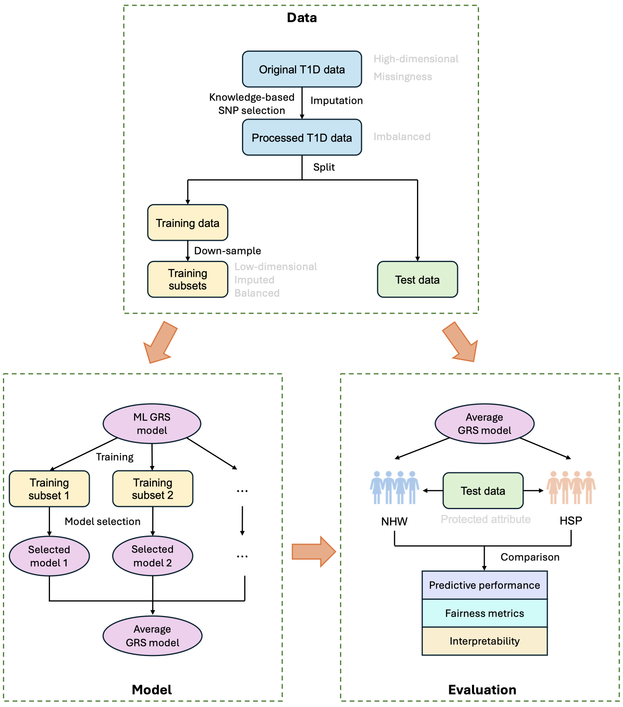

# RiskScoreModels-Evaluation

We present a comprehensive evaluation framework for machine learning-based risk score models applied across diverse healthcare domains such as type 1 diabetes (T1D), breast cancer, and cardiovascular diseases. Our code will be released upon paper acceptance. 

## Framework
As shown in Figure 1, the performance and reliability of a risk score model should be assessed along six complementary dimensions:

- Predictive Performance: how accurately the risk score model predicts outcomes such as disease onset.
- Uncertainty Quantification: the ability to measure confidence and reliability of predictions.
- Robustness: the stability of model performance under data shifts, noise, or adversarial perturbations.
- Computational Efficiency: the feasibility of deploying models in real-time clinical environments with limited computational resources.
- Algorithmic Fairness: ensuring that predictions are equitable across subpopulations, mitigating biases related to factors like gender and race.
- Explainability: the transparency of model reasoning that allows clinicians to interpret and trust the results.

 
     
    <em>Fig. 1 Evaluation metrics of risk score models in healthcare.</em>

Figure 2 shows an example evaluation process on the three evaluation aspects, i.e., predictive performance, fairness metrics and model explainability, in T1D. It incldues three components: data, model and evaluation. Data: We first preprocessed the imbalanced data with missing value imputation and downsampling and split it into clean training data and test data. Model: We trained the risk score models on the training data and used cross validation to select the best models. Evaluation: We tested the models on the test data from three evaluation aspects.

 
     
    <em>Fig. 2 An example evaluation on the predicitive performance, algorithmic fairness and explainability in T1D.</em>

## Contact

**Ryan (Feng) Lin**  
_Ph.D. Student_  
ryanflin@uw.edu

**Congjing Zhang**  
_Ph.D. Student_  
congjing@uw.edu

**Shuai Huang**  
_Professor_  
shuaih@uw.edu
